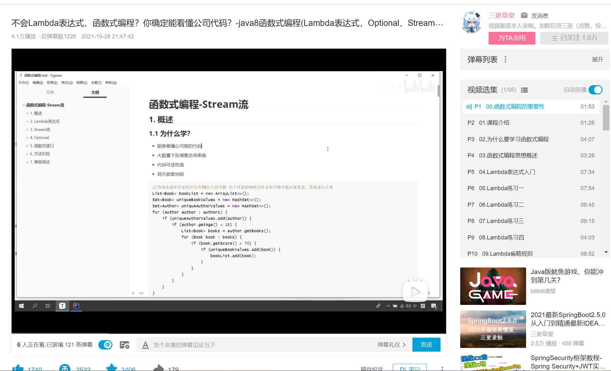

# hello-java8

## map vs flatMap

> [Java Stream的flatMap和map的区别](https://blog.csdn.net/catoop/article/details/105987386)

> **refer to:**
>
> [ 不会Lambda表达式、函数式编程？你确定能看懂公司代码？-java8函数式编程(Lambda表达式，Optional，Stream流)从入门到精通-最通俗易懂 ](https://www.bilibili.com/video/BV1Gh41187uR?share_source=copy_web)
>
> 

